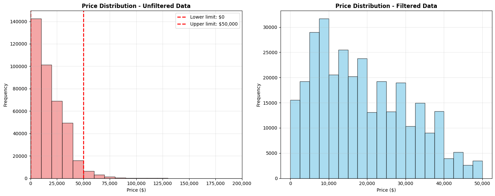
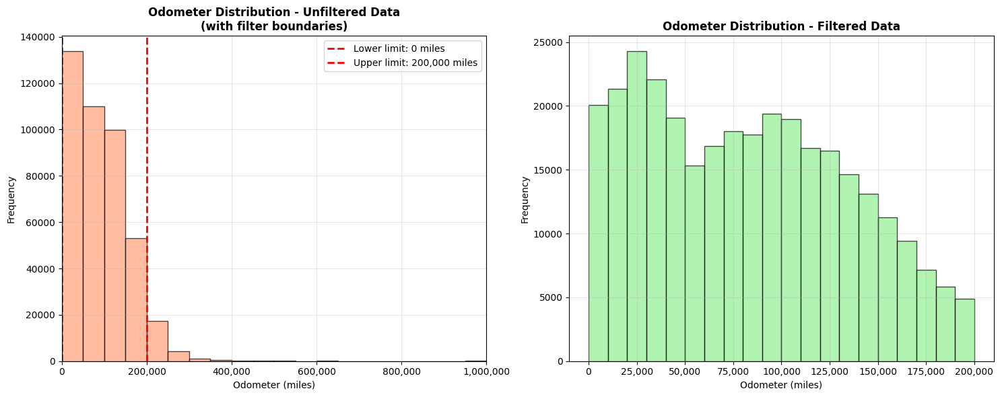
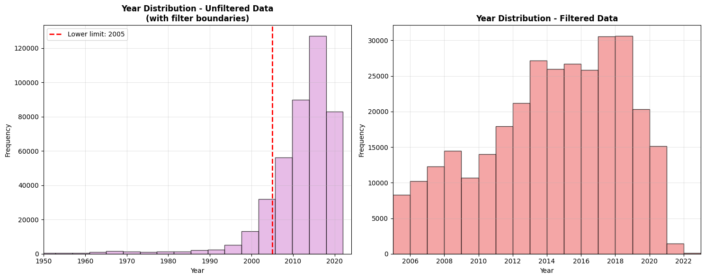
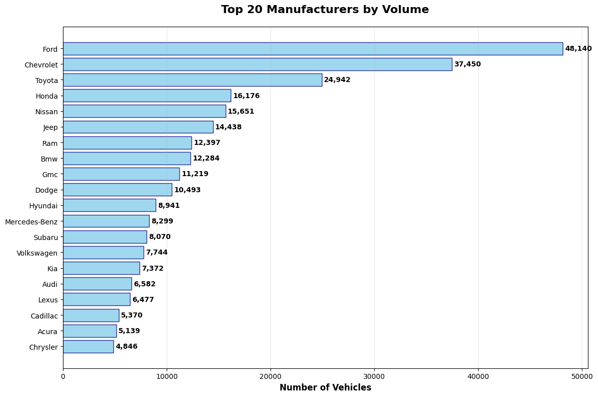
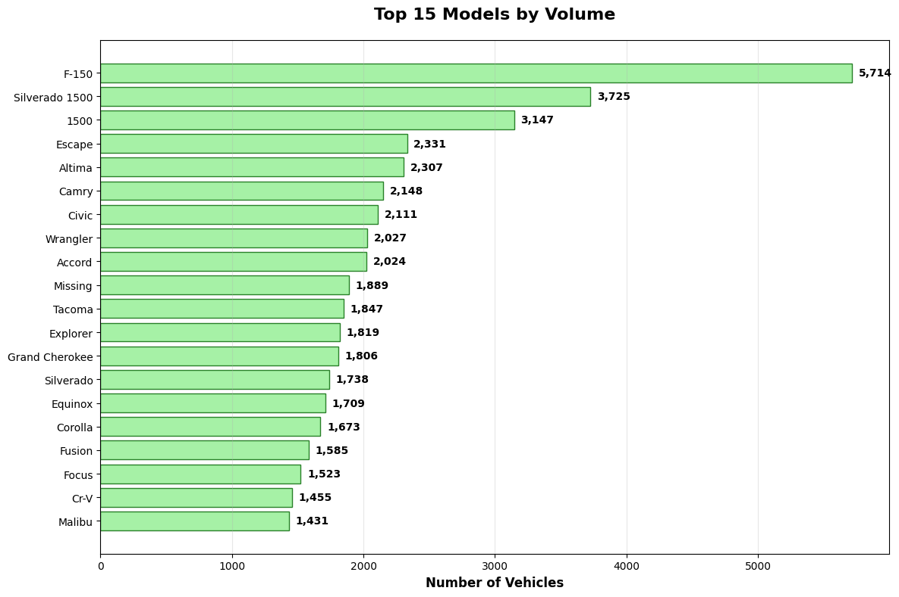
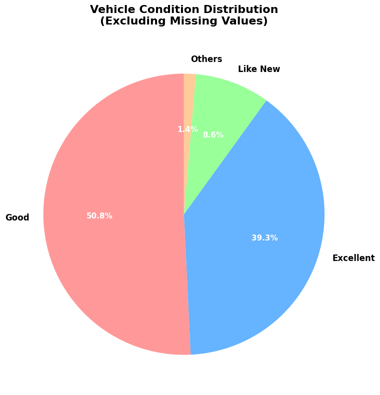
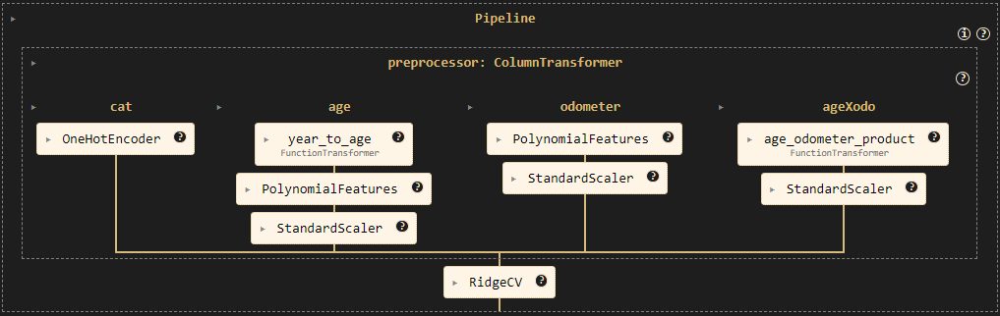
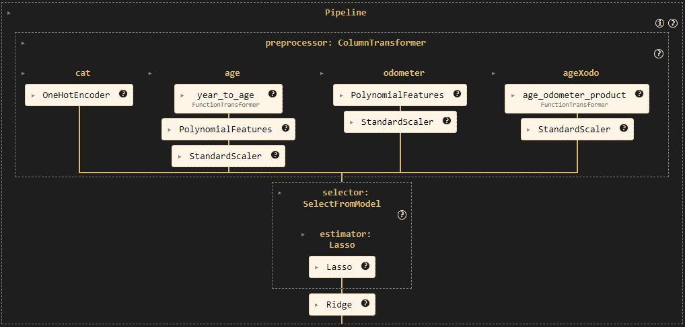
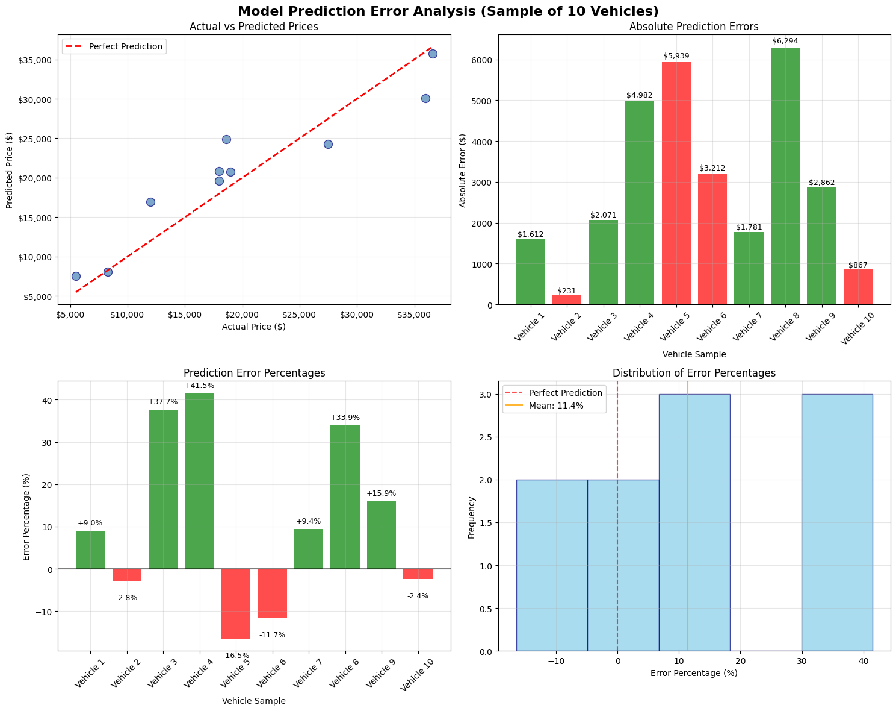

# 🚗 Used-Car Price Prediction Project

A data-driven approach to pricing used-car inventory, this project follows the **CRISP-DM framework** to deliver actionable insights for automotive dealerships. The goal is to predict the resale value of over +400k used-car listings and provide data-backed pricing guidance.

**Author:** John Santa (johnjairo@gmail.com)  
**Prepared for:** University of Berkeley, Professional Certificate in Machine Learning and AI

### 📒 Key Notebooks
| Notebook | Purpose | Key Take-aways |
| :--- | :--- | :--- |
| **`biz_understanding.ipynb`** | Define business goals & success metrics | MAE threshold tied to gross profit; outlines dealership objectives. |
| **`data_prep.ipynb`** | Data cleaning, EDA, and feature engineering | Retains 73% of data; delivers a modeling-ready frame. |
| **`modeling.ipynb`** | Baseline & tuned models | Tests RidgeCV vs. Lasso-selected Ridge; implements feature engineering. |
| **`evaluation.ipynb`** | Hold-out performance & feature insights | R² ≈ 0.64, MAE ≈ $5,000; finds 80% feature-importance overlap. |
| **`deploy.ipynb`** | Train on full data & demonstrate usage | Production-ready `Pipeline` with 287 features. |

**Best pipeline**: *Lasso Feature Selection (α=1.0) → Ridge Regression (α=1.0)*. This hybrid approach uses Lasso to select the most impactful features and Ridge to build a robust, generalizable model on that subset.

### 🚀 Getting Started / Installation
```bash
# Clone the project
git clone https://github.com/jojasan/kaggle-used-cars.git
cd kaggle-used-cars

# Create & activate environment
python -m venv venv
source venv/bin/activate  # On Windows, use `venv\Scripts\activate`

# Install requirements
pip install -r requirements.txt
```
> **Note on `scikit-learn-intelex`**  
> This project uses the Intel® Extension for Scikit-learn to accelerate training. If you are not using Intel hardware or wish to use the stock library, you can comment out `scikit-learn-intelex` in `requirements.txt`.

## 📚 Table of Contents
1. [Executive Summary](#executive-summary)
2. [Business Understanding](#-business-understanding)
3. [Data Understanding](#-data-understanding)
4. [Data Preparation](#-data-preparation)
5. [Modeling](#-modeling)
6. [Evaluation](#-evaluation)
7. [Deployment](#-deployment)
8. [Repository Structure](#-repository-structure)
9. [License](#-license)

---

## 📝 Executive Summary

### 🎯 Key Findings:
- **📊 Model Performance**: 2 pipelines were tested (`RidgeCV` & `Lasso Selector → Ridge`), both achieve nearly identical performance (RMSE ~$7,200 / MAE ~$5,000)
- **🔧 Feature Selection Impact**: Lasso feature selection removes 23% (87 out of 374) of features with minimal performance trade-off
- **⚡ Model Agreement**: 80% overlap in top 20 most important features between models
- **🏆 Top Predictors**: Tesla brand, fuel type (electric/hybrid), and vehicle condition drive predictions

### 📈 Business Impact:
- **Prediction Accuracy**: Models predict prices within ~$5,000 (27% of average price)
- **Feature Insights**: Premium brands and fuel efficiency significantly impact valuation


## 💼 1. Business Understanding

### Project Motivation
Used-car prices vary wildly—even for nearly identical vehicles. **Dealerships that price too high lose sales; price too low and they leave money on the table.** Our core business problem is to mitigate this risk.

> *Which factors most strongly influence the sale price of a used car, and how can we set a competitive yet profitable asking price for every vehicle in inventory?*

### Business & Analytics Objectives
| | Goal |
| :--- | :--- |
| **Business Objective** | *Maximize gross profit **and** inventory turnover* by pricing each unit within a data-driven range that local buyers are willing to pay. |
| **Analytics Objective** | Ship a **pricing-assist notebook** that returns:<br>1) **Best-guess price** (point estimate)<br>2) **Prediction interval** (lower / upper bound)<br>3) **Feature-driven explanations** for every estimate |

### Success Criteria
The primary success metric is a **Mean Absolute Error (MAE) of ≤ $1,600** on a hold-out test set.

> **Why $1,600?**  
> - The typical gross profit per used car in the U.S. is **$1,300 – $1,600**.
> - Keeping MAE below this threshold caps pricing error so it doesn't eliminate the profit margin on an average vehicle.
> - This corresponds to a ~6.5% MAPE on an average retail price of $25k, an acceptable band for the business.

---

## 📊 2. Data Understanding
The analysis is based on a Kaggle dataset of 426,880 raw vehicle listings. After cleaning, 312,846 unique vehicle records were retained for modeling. The target variable is `price` (USD), and key predictors include vehicle age, odometer reading, manufacturer, model, and condition.

### Key Data Distributions

| Price Distribution | Odometer Distribution | Year Distribution |
| :---: | :---: | :---: |
|  |  |  |

*Outliers were filtered to focus on prices between $1 and $50,000, odometers up to 200,000 miles, and model years from 2005-2023.*

### Categorical Feature Insights

**Manufacturer & Model Counts:** The market is dominated by a few key players. Ford and Chevrolet are the most frequent manufacturers, with the F-150 and Silverado pickups being top models.

| Top Manufacturers | Top Models |
| :---: | :---: |
|  |  |

**Vehicle Condition Analysis:** Most vehicles are listed in "Good" or "Excellent" condition. A heatmap reveals that the median price is highly sensitive to both the manufacturer and the vehicle's condition, with premium brands like Porsche and Tesla commanding higher prices across all conditions.

| Condition Distribution | Condition-Manufacturer Price Heatmap |
| :---: | :---: |
|  |  |

## 🛠️ 3. Data Preparation

The raw dataset of **426,880 records** was transformed into a clean, modeling-ready dataset of **312,846 records** (73% retention).

### Key Achievements:
- ✅ **Missing Data Handled:** Treated 40-70% missing values in critical features (`condition`, `paint_color`, `type`) via imputation.
- ✅ **High Cardinality Reduced:** Shrunk 29k+ unique models to 116 categories and 404 regions to 121 by grouping less frequent entries into "other" categories.
- ✅ **Outliers Filtered:** Constrained data to realistic price ($1-$50k), mileage (0-200k), and year (2005-2023) ranges.
- ✅ **Features Optimized:** Dropped 4 non-predictive columns, retaining 14 features for modeling.

The final dataset is free of missing values with standardized categories, ready for the modeling phase.

## 📈 4. Modeling

### 🎯 Modeling Approaches Tested
1. **RidgeCV**: Cross-validated Ridge regression with automatic alpha selection
2. **Lasso Feature Selection + Ridge**: Two-stage approach using Lasso for feature selection followed by Ridge regression

<p align="center">
  <strong>Pipeline 1: RidgeCV</strong>
</p>



<p align="center">
  <strong>Pipeline 2: Lasso Selector → Ridge</strong>
</p>




### ⚙️ Feature Engineering Pipeline
This project constructs a sophisticated preprocessing pipeline that transforms raw features into model-ready inputs:

**🔧 Transformation Steps:**
1. **📅 Age Calculation**: Convert `year` → `age` (current_year - vehicle_year)
2. **📈 Polynomial Features**: Generate `age²` and `odometer²` for non-linear relationships
3. **🔗 Interaction Terms**: Create `age × odometer` interaction feature
4. **🏷️ Categorical Encoding**: One-hot encoding with first category dropped
5. **📏 Feature Scaling**: StandardScaler normalization for numerical features

**🎯 Pipeline Architecture:**
- **Categorical Pipeline**: OneHotEncoder → handles unknown categories gracefully
- **Age Pipeline**: Year→Age transformation → Polynomial(degree=2) → StandardScaler  
- **Odometer Pipeline**: Polynomial(degree=2) → StandardScaler
- **Interaction Pipeline**: Age×Odometer multiplication → StandardScaler

### 🏆 Key Results
- **Best Model**: Lasso Feature Selection + Ridge (`selector__estimator__alpha=0.01`, `model__alpha=1.0`)
- **Performance**: RMSE of **$7,130** (13.1% improvement over worst configuration)
- **Training Data**: 312,846 used car records with 12 engineered features
- **Feature Engineering**: `year` → `age` transformation, polynomial features for `age` and `odometer` (degree = 2), and interaction term (age x odometer)


## 💯 5. Evaluation

The final model was evaluated on a 20% hold-out test set (62,570 records).

*   **Performance**:
    *   **RMSE**: ≈ $7,208
    *   **MAE**: ≈ $5,062
    *   **R²**: ≈ 0.644
*   **Top Value Drivers**:
    *   **Brand** – Tesla & premium manufacturers like Porsche command the highest prices.
    *   **Model** - Specific high-demand models like the Corvette also significantly increase value.
    *   **Fuel Type** – Electric & hybrid vehicles have distinct pricing patterns.
    *   **Condition** – Vehicles sold for "parts only" see a major price reduction.

> ℹ️ **Gap to Success Criterion**  
> The current MAE of ~$5,000 exceeds the **$1,600 target**. Future work should focus on richer feature sets (e.g., service records, local market comparables) and more complex, non-linear models like Gradient Boosting or neural networks to capture more nuanced relationships.

### Error Analysis
The model's predictions are generally well-aligned with actual prices, but some outliers exist. The chart below shows actual vs. predicted prices and the distribution of prediction errors on a sample of 10 vehicles.



## 🚀 6. Deployment

The final, trained `scikit-learn` pipeline is available in `notebooks/deploy.ipynb`. It is ready to make predictions on new, unseen data. The notebook provides a simple interface to input vehicle details and receive a price estimate.

**Usage Example:**
A 2015 Chevrolet Impala in "excellent" condition with 25,000 miles is predicted to have a price of **$14,497**.

## 📂 Repository Structure
```
.
├── data/
│   ├── vehicles.csv
│   ├── vehicles_processed.csv
│   └── lasso_selected_features.csv
├── images/
│   ├── ... (visualizations and diagrams)
├── notebooks/
│   ├── biz_understanding.ipynb
│   ├── data_prep.ipynb
│   ├── modeling.ipynb
│   ├── evaluation.ipynb
│   ├── deploy.ipynb
│   └── utils.py (boilerplate code and utils)
├── requirements.txt
├── prompt_II.ipynb (original exercise prompt)
└── README.md
```

## 📜 License
Distributed under the **MIT License**. See `LICENSE` for details.
